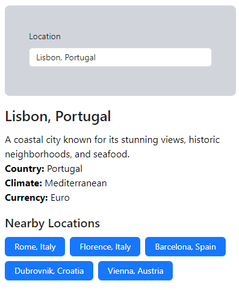

# Travel Destinations

An application for searching travel destinations

# Table of Contents
1. [Introduction](#introduction)
2. [Design Choices](#design-choices)
3. [Technology Choices](#technology-choices)
4. [Getting Started](#getting-started)
7. [Contributing](#contributing)
8. [License](#license)

## Introduction

ℹ️ This project has been developed as part of Mozio's application test

Users should be able to search for destinations and view details about them. Additionally, they will be able to see nearby destinations suggestions based on the selected destination.

## Design Choices

I decided to use Layered Architecture (which is actually Design, not Architecture), separating the code into at least three layers:
- Presentation layer: responsible for the UI and rendering components. You can take [destination-details/index.tsx](./src/destination-details/index.tsx) as an example;
- Business Logic layer: it contains the core business logic and data processing, and it's generally a custom hook. An example is [useFetchDestinationDetails.ts](./src/destination-details/hooks/useFetchDestinationDetails.ts). All component logic was extracted to custom hooks, in order to leave the business logic concentrated here and also to leave the presentation layer with its own responsibilities.
- Data Access layer: it handles data persistence and access like HTTP requests, storage, etc. Take a look at [fake-api.ts](./src/fake-api.ts). This DestinationsFakeAPI access the resources directly, so I added another layer that is the "adapter" of the API. It's a simple DAO (Data-Access Object) that you can see in [services/DestinationService.ts](./src/services/DestinationService.ts). The benefits of using this pattern, is that you can change the API as you wish, as long as you maintain the contract.

You can argue this Layered "Architecture" is very similar to an Hexagonal Architecture.

- Cache: I decided to implement a Cache Service using localStorage, since it's built-in and easy to use. If there were actions that changed the data (such as POSTs or PUTs), I'd refetch the data;

- Debounce: I implemented it on the useDestinationSearch, using the lodash debounce function;

- Error handling: The mock scenario where you write "fail" works by adding a red text bellow the search combobox. Besides that, I treated Error Handling as simply as it can be: every backend call has a try/catch and a console.log for errors. Since there weren't any special request for errors, besides the "fail" scenario, I thought it wouldn't hurt to leave it like that.

## Technology Choices

- React and Typescript - Were a must on this test, but if it was optional, I'd still use them;
- Vite -  I decided to use Vite because it provides a fast start, which I need to developed this project in under 24 hours. It supports React, Typescript and Tailwind;
- antd - I have lots of experience using Ant Design. When I saw the challenge for the first time, I instantly knew which components to use, especially the "Select" one. Besides having beautiful components, antd provides lots of complex components and is easy to plug on Vite;
- Tailwind CSS - It goes without saying that Tailwind CSS is famous and it helps a lot with the headache that CSS can be in React. This was an easy choice, though it could be completely avoided by using css-in-js, since this was a simple UI;
- lodash.debounce - There was no point in creating my own solution, when a pretty solid one was "a npm install away". I understand adding all loadash would've been too much for too little, so I decided to only add the debounce function.
- gh-pages - I used it to deploy my application faster on GitHub Pages;

## Getting Started
### Installation

After cloning this project, you can install it using:
```bash
npm install
```

### Running the Application
If everything is right with the Installation, you'll be able to run the application:
```bash
npm run dev
```
Access `http://localhost:5173/travel-destinations/`.


## Usage

You just need to type in a name of a destination you want to search. Keep in mind there are only 20 destinations available for you to search. After clicking on the destination, you'll see its details and the top 5 nearby destinations.



When you click on a nearby destination, you get to see a "Go back" link to the current state (selected destination).

## License

See the [LICENSE](./LICENSE.md) file for license rights and limitations (MIT).